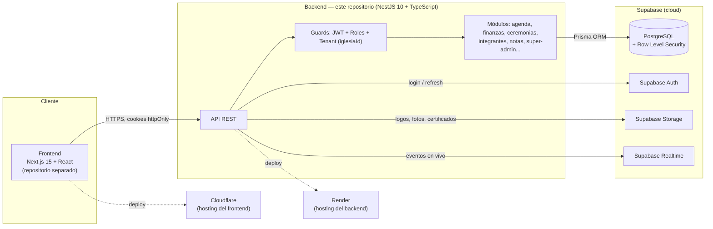

# EvangelicApp

## Descripción

EvangelicApp es una plataforma de gestión para iglesias evangélicas de Chile. Centraliza en un
solo sistema tres cosas que hoy la mayoría de las iglesias manejan de forma manual o dispersa
(papel, WhatsApp, planillas sueltas sin trazabilidad):

- **Agenda** — calendario de eventos, confirmación de predicadores y asistencia de la
  congregación mediante links de un solo uso (sin necesidad de cuenta).
- **Finanzas** — ingresos y egresos con auditoría inmutable: nada se borra realmente, cada
  edición o eliminación queda registrada con quién, cuándo y el estado anterior.
- **Notas y tareas** internas del equipo pastoral, y un **censo de integrantes** vía código QR.

**¿A quién va dirigida?** Al equipo pastoral de una iglesia — Pastor (dueño de la cuenta),
Tesorero y Secretaria — con un rol adicional de SuperAdmin operado por el equipo de
EvangelicApp para dar de alta nuevas iglesias a nivel nacional.

**¿Qué problema resuelve?** La falta de trazabilidad y de una herramienta pensada específicamente
para el flujo de trabajo de una iglesia: coordinar predicadores por llamadas, llevar las finanzas
en cuadernos o Excel sin auditoría, y no tener un registro digital confiable de la congregación.

**Estado del proyecto:** pre-lanzamiento. Es un proyecto en desarrollo activo (capstone); los
datos que existen hoy (iglesias, movimientos, integrantes) son datos de demo/prueba, no una
iglesia real operando en producción.

## Tecnologías utilizadas

| Categoría | Tecnología |
|---|---|
| Backend | [NestJS](https://nestjs.com/) 10 + TypeScript 5 (Node.js 20) |
| Frontend | [Next.js](https://nextjs.org/) 15 + React 18 + TypeScript, TailwindCSS, Radix UI, Zustand |
| Base de datos | PostgreSQL, gestionada por [Supabase](https://supabase.com/) |
| ORM | [Prisma](https://www.prisma.io/) 5 |
| Autenticación | Supabase Auth (GoTrue), sesión vía JWT verificado con JWKS (`jose`) |
| Almacenamiento de archivos | Supabase Storage (logos, fotos de perfil, fotos de integrantes) |
| Tiempo real | Supabase Realtime (WebSocket) |
| Cloud / Hosting | Supabase (base de datos + Auth + Storage + Realtime), [Render](https://render.com/) (API backend), [Cloudflare](https://developers.cloudflare.com/) vía OpenNext (frontend) |
| Email / WhatsApp | Nodemailer / [Resend](https://resend.com/), Meta WhatsApp Business Cloud API |
| Testing | Jest + ts-jest |
| CI | GitHub Actions |
| Contenedores | Docker + Docker Compose |

## Integrantes del equipo

| Integrante | Rol |
|---|---|
| Matías Cofré | Desarrollador Full Stack (Backend, Frontend, Base de Datos e Infraestructura/DevOps) — único integrante del proyecto |

## Metodología de trabajo

**Scrum**, adaptado a un equipo de un solo integrante: el trabajo se organiza en iteraciones
sobre un backlog priorizado de funcionalidades, con revisión y reordenamiento de prioridades al
cierre de cada iteración. Al no haber más integrantes, los roles de Product Owner, Scrum Master y
Development Team los asume la misma persona.

## Arquitectura de la solución

El sistema separa **backend** y **frontend** en dos aplicaciones independientes (decisión
deliberada, no monorepo) que se comunican por HTTPS — en desarrollo cada una vive en su propio
repositorio; este repositorio agrupa una copia de ambas (`backend/`, `frontend/`) para la entrega
del capstone. El backend es la única puerta de entrada a los datos: aplica autenticación, reglas
de rol y **aislamiento multi-tenant** (cada iglesia es un tenant aislado, reforzado tanto a nivel
de aplicación como con Row Level Security en Postgres).



**Modelo de tenant:** un `SUPER_ADMIN` (equipo de EvangelicApp) da de alta cada `Iglesia` junto a
su `MANAGER` (pastor). El `MANAGER` invita a su equipo (`USUARIO` — tesorero/secretaria), que solo
ve los datos de su propia iglesia. El backend nunca confía en un `iglesiaId` que venga del
cliente: siempre sale del JWT de la sesión.

Detalle técnico completo (módulos, guards, auditoría financiera, RLS) en
[`backend/README.md`](./backend/README.md).

## Ejecutar el proyecto localmente

### Requisitos

- [Docker](https://docs.docker.com/get-docker/) + Docker Compose (opción recomendada), **o**
  Node.js 20 LTS + PostgreSQL 14+ si se prefiere correr sin Docker.
- Un proyecto de [Supabase](https://supabase.com/) (puede ser uno gratuito y descartable, creado
  solo para desarrollo). **Es obligatorio incluso para correr el backend en local**: el módulo de
  Storage se instancia de forma global al arrancar la app y su constructor falla duro
  (`Error: supabaseKey is required`) si `SUPABASE_URL`/`SUPABASE_SERVICE_ROLE_KEY` vienen vacíos —
  a diferencia de Auth o Realtime, que sí son opcionales y solo deshabilitan esa función con un
  warning. Sacá ambos valores de tu proyecto en Project Settings → API.

### Opción A — Con Docker (recomendada)

Este repositorio incluye un `Dockerfile` (build multi-etapa del backend) y un
`docker-compose.yml` con dos servicios: `postgres` (base de datos descartable para desarrollo) y
`app` (la API NestJS, construida desde el `Dockerfile`).

```bash
cd backend
cp .env.example .env      # completar SUPABASE_URL / SUPABASE_SERVICE_ROLE_KEY (obligatorio,
                           # ver "Requisitos") y el resto de los valores que necesites
docker compose up --build
```

Eso hace, en orden:

1. Levanta `postgres` (Postgres 16) y espera a que su healthcheck esté OK.
2. Construye la imagen de `app` (`npm ci`, `prisma generate`, `npm run build`).
3. Al iniciar el contenedor `app`, su `docker-entrypoint.sh` corre `prisma migrate deploy`.

La API queda disponible en `http://localhost:3001`.

> **Nota — migraciones exclusivas de Supabase:** 3 de las 20 migraciones
> (`20260907131802_realtime_broadcast_authorization`, `20260908204221_realtime_convocatoria_topic`,
> `20260909223000_lockdown_internal_public_tables`) tocan objetos que solo existen en un proyecto
> Supabase real (schema `realtime`, roles `anon`/`authenticated`/`app_runtime`) — en un Postgres
> vanilla como el de este `docker-compose` **fallan siempre, por diseño** (ver "Pendientes
> conocidos" en [`backend/README.md`](./backend/README.md)). `docker-entrypoint.sh` ya lo maneja
> solo: si `migrate deploy` falla, resuelve esas 3 puntuales como aplicadas (sin ejecutar su SQL,
> igual que se hizo contra los proyectos reales) y reintenta — no hace falta ninguna acción manual
> para levantar el sistema con Docker.

> **Nota — red interna de `docker compose`:** el contenedor `app` se conecta a Postgres por el
> nombre del servicio (`postgres`), no por `localhost` — por eso `docker-compose.yml` sobrescribe
> `DATABASE_URL` para ese servicio en particular; el resto de las variables (mail, JWT, Supabase,
> etc.) las toma tal cual de tu `.env` vía `env_file`.

Para bajar todo: `docker compose down` (agregar `-v` si además querés borrar los datos de
Postgres).

### Opción B — Sin Docker (Node.js local)

```bash
cd backend
npm install
cp .env.example .env      # DATABASE_URL a un Postgres local + SUPABASE_URL/SUPABASE_SERVICE_ROLE_KEY
                           # reales (obligatorio, ver "Requisitos")
npm run prisma:generate
npm run prisma:migrate    # aplica las migraciones en prisma/migrations
npm run prisma:seed       # datos de demo (opcional)
npm run start:dev
```

Si es la primera vez que corrés las migraciones contra un Postgres local recién creado, `prisma
migrate` se va a detener en `20260907131802_realtime_broadcast_authorization` (ver la nota de
arriba). Para destrabarlo manualmente:

```bash
npx prisma migrate resolve --applied 20260907131802_realtime_broadcast_authorization
npx prisma migrate resolve --applied 20260908204221_realtime_convocatoria_topic
npx prisma migrate resolve --applied 20260909223000_lockdown_internal_public_tables
npx prisma migrate deploy   # aplica el resto
```

La API queda en `http://localhost:3001` (o el `PORT` que definas en `.env`).

### Variables de entorno

Documentadas en detalle en [`backend/.env.example`](./backend/.env.example). Las esenciales para
levantar el backend localmente:

| Variable | Uso |
|---|---|
| `DATABASE_URL` | Connection string de PostgreSQL para Prisma |
| `PORT` | Puerto HTTP de la API (default `3001`) |
| `CORS_ORIGIN` | Origen(es) permitidos para el frontend (ej. `http://localhost:3000`) |
| `NODE_ENV` | `development` / `production` — en `production` las cookies de auth exigen HTTPS |
| `JWT_ACCESS_SECRET` / `JWT_REFRESH_SECRET` | Secretos locales de las cookies de sesión |
| `FRONTEND_URL` / `BACKEND_URL` | Usadas para construir links absolutos en emails |
| `SUPABASE_URL` / `SUPABASE_SERVICE_ROLE_KEY` | **Obligatorias** — proyecto de Supabase usado para Storage. Vacías, la app no arranca (ver "Requisitos" arriba) |
| `SUPABASE_AUTH_TEST_URL` / `SUPABASE_AUTH_TEST_SERVICE_ROLE_KEY` / `SUPABASE_AUTH_TEST_ANON_KEY` | Proyecto de Supabase (puede ser el mismo u otro) usado para Auth — sin esto el login real no funciona |
| `MAIL_PROVIDER`, `SMTP_*` / `RESEND_API_KEY` | Envío de correo (SMTP local por defecto) |
| `WHATSAPP_*` | Opcionales — sin `WHATSAPP_ACCESS_TOKEN` la convocatoria por WhatsApp queda desactivada y el email sigue funcionando igual |

**Nunca** se commitea un `.env` con secretos reales — está en `.gitignore`. `.env.example` es la
plantilla y no contiene secretos válidos.

### Frontend

Con el backend ya corriendo (Docker o local) en `http://localhost:3001`:

```bash
cd frontend
npm install
cp .env.example .env
npm run dev
```

Queda en `http://localhost:3000`. `NEXT_PUBLIC_API_URL` en `frontend/.env` debe apuntar al
backend (`http://localhost:3001` por defecto). El resto de las variables
(`NEXT_PUBLIC_SUPABASE_URL`/`NEXT_PUBLIC_SUPABASE_ANON_KEY`, `NEXT_PUBLIC_BIBLIA_API_KEY`) son
opcionales: sin ellas el frontend arranca igual, solo se desactivan el tiempo real y la card del
"versículo del día". Detalle completo en [`frontend/README.md`](./frontend/README.md).

## Testing

```bash
cd backend
npm test
```

## CI

`.github/workflows/ci.yml` corre en cada push/PR: instala dependencias, genera el cliente de
Prisma, lintea, compila y corre los tests.
